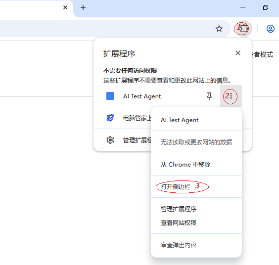

# 🤖 AI Test Agent

**AI 驱动的浏览器自动化测试助手。**

一句话：安装 → 打开侧面板 → 输入指令 → AI 帮你操作浏览器。

## ✨ 功能

- **自然语言操控浏览器** — "截图"、"点击登录"、"提取文章标题"
- **智能测试** — "测试这个登录流程"、"检查搜索功能是否正常"
- **一键操作** — 截图、查看 URL/标题、提取全文、滚动页面
- **支持 OpenAI / Claude** — 可选 GPT-4o-mini 或 Claude 3 Haiku
- **零配置** — 安装即用，唯一需要的是 API Key

## 🚀 安装

### 从 Chrome Web Store 安装（待上架）
1. 打开 Chrome Web Store
2. 搜索 "AI Test Agent"
3. 点击 "添加到 Chrome"

### 开发者模式安装
1. 下载本项目代码
2. 打开 Chrome → `chrome://extensions`
3. 打开右上角 **开发者模式**
4. 点击 **加载已解压的扩展程序**
5. 选择 `extension` 文件夹

## 🎯 使用

安装后在工具栏点击 AI Test Agent 图标打开侧面板：

> 💡 **找不到图标？** 点击工具栏右边的拼图图标 🔧，把 AI Test Agent 固定在工具栏即可。

### 侧面板功能

1. 点击工具栏的 🤖 图标 → 打开侧面板
2. 在 ⚙️ 设置页输入你的 API Key（OpenAI 或 Anthropic）
3. 切换到 💬 对话页，输入指令：

> *"截图当前页面"*
> *"点击搜索按钮"*
> *"提取所有文章标题"*
> *"帮我测试这个登录功能"*

## 🔧 手动工具

切换到 🔧 工具页，提供一键操作：
- **截图** — 截取当前页面
- **当前 URL** — 获取页面地址
- **提取全文** — 提取可见文本
- **页面标题** — 获取标题
- **向下滚动** / **回到顶部**

## 🗺️ 路线图

- [ ] Chrome Web Store 上架
- [ ] MCP Server 支持（与 Claude/Codex 原生集成）
- [ ] 测试用例录制与回放
- [ ] 测试报告导出（HTML/JSON）
- [ ] 可视化断言

## 📄 License

MIT
